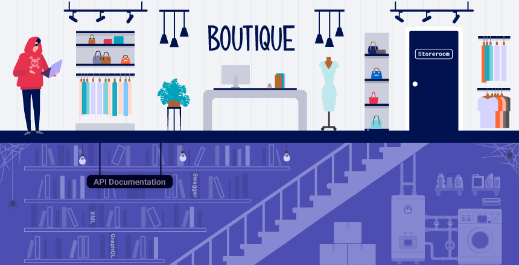

# API testing

## API Recon
Recon để thấy endpoint rồi quyết định thực hiện tấn công như thế nào.
## API documentation
API Documentation là phần để dev đọc và hiểu các sử dụng chúng. API Doc có cả ở dạng máy và dạng cho người đọc. Cho người gồm các thông tin như giải thích chi tiết, tình huống sử dụng... Còn dạng máy để tự động hóa các tác vụ tích hợp như xác thực. Trong trường hợp này, thường sẽ được viết ở dạng XML, JSON. API Doc thường được public, đây là lỗ hổng để kẻ tấn công lợi dụng. 
### Bài lab: Exploiting an API endpoint using documentation
Mục tiêu bài lab: Sử dụng API endpoint từ API Doc để lựa chọn base path phù hợp. Trong bài lab này, khi truy cập đúng base path cần xóa người dùng Carlos.  
Base path khi sửa:

Xem trên trình duyệt:

Xóa người dùng Carlos:

```
- Có thể sử dụng các công cụ rà quét để tìm kiếm và phân tích API Doc (ở trường hợp đọc bằng máy) như Burp Scanner (với JSON, YAML) hoặc  OpenAPI Parser BApp (với Open API).  
- Ngoài ra, cần check các file JS vì có thể chứa các API endpoint chưa kích hoạt 
```

## Một số HTTP Method cần lưu ý
- `GET` - Lấy dữ liệu từ một nguồn tài nguyên. 
- `PATCH` - Áp dụng những thay đổi một phần cho một tài nguyên.
- `OPTIONS` - Truy xuất thông tin về các loại phương thức yêu cầu có thể được sử dụng trên một tài nguyên.

## Thay đổi content-ype
Thay đổi content-tyoe có thể cho phép bạn:
- Kích hoạt lỗi tiết lộ thông tin hữu ích.
- Bỏ qua các biện pháp phòng thủ có khiếm khuyết.
- Tận dụng sự khác biệt trong logic xử lý. Ví dụ, API có thể an toàn khi xử lý dữ liệu JSON nhưng dễ bị tấn công tiêm nhiễm khi xử lý XML.
### Bài lab: Finding and exploiting an unused API endpoint

## Sử dụng Industrer để tìm endpoint bị ẩn và khai thác


