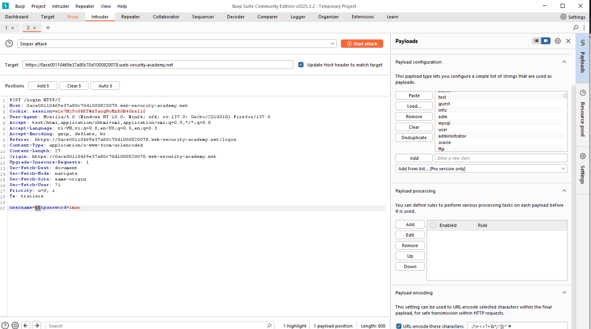
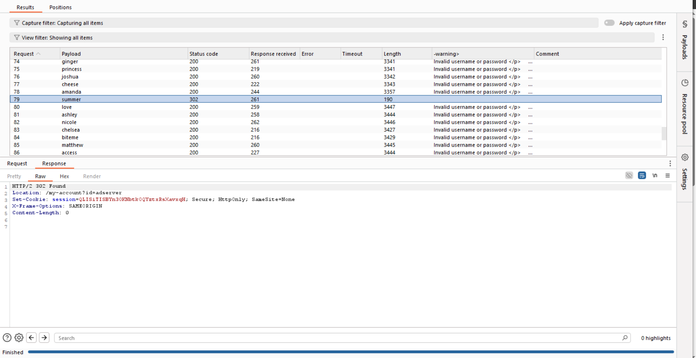

# Lỗ hổng xác thực (Authentication)

## Authentication là gì
Authentication là quá trình xác định user hoặc client.  
Các loại xác thực:
- Xác thực với những gì bạn BIẾT: kiểu mật khẩu, tài khoản
- Xác thực với những gì bạn CÓ: kiểu token
- Xác thực với những gì bạn LÀ: kiểu vân tay
## Authentication (Xác thực) vs Authorization (Trao quyền)
Authentication là quá trình xác định user là ai  
Authorization là quá trình xác định user có quyền gì
## Các lỗ hổng Authentication phổ biến
Có 2 loại phổ biến:
- Cơ chế xác thực yếu dẫn đến các cuộc tấn công bruteforce
- Lỗi logic hoặc mã hóa yếu dẫn đến kẻ tấn công có thể bỏ qua quá trình xác thực (broken authentication)
## Lỗ hổng Authentication dựa vào password đăng nhập
Trong tấn công bruteforce, cần chú ý tới 1 số yếu tố ở response để xác định:
- Status code (200, 402...)
- Error message
- Response time

### Bài lab: Username enumeration via different responses
Mục tiêu bài lab: Bruteforce để tìm ra danh mục username và các mật khẩu, trong bài lab có đưa ra danh sách ứng viên username và password thường dùng. Hoàn thành bài lab bằng việc đăng nhập vào 1 user.
Thử với các tên người dùng khác nhau trong Intruder

Username là mysql thì trả về sai pass, còn lại trả về Invalid username

Thử với các password khác nhau thấy 123456789 cho về status code 302

Nhập username và password vào thành công.

### Bài lab: Username enumeration via subtly different responses
Mục tiêu bài lab: Bruteforce để tìm ra danh mục username và các mật khẩu, trong bài lab có đưa ra danh sách ứng viên username và password thường dùng. Hoàn thành bài lab bằng việc đăng nhập vào 1 user. Ở đây điểm khác biệt là response không hiện rõ như bài lab trước.
Phần này trả về khác, khả năng là username chính xác

Thử với các password

Nhập username và password vào thành công.
### Bài lab: Username enumeration via response timing

### Bảo vệ khỏi cuộc tấn công brute force
Có 2 cách bảo vệ:
- Khóa tài khoản nếu đăng nhập sai quá nhiều 
- Chặn IP người dùng thực hiện quá nhiều việc đăng nhập
Tuy nhiên, các biện pháp bảo vệ này tồn tại 1 lỗ hổng đó là chỉ đếm số đăng nhập lỗi, vậy kẻ tấn công chỉ cần đăng nhập thành công vào tài khoản của kẻ tấn công, rồi lại tiếp tục thực hiện là có thể bypass cách này

### Bài lab: Broken brute-force protection, IP block
Mục tiêu bài lab: Thực hiện bruteforce password vài tài khoản carlos, tài khoản kẻ tấn công là wiener:peter. Có thực hiện block IP khi đăng nhập sai nhiều lần

### Bài lab: Broken brute-force protection, IP block
Mục tiêu bài lab: Thực hiện bruteforce username và password. Trong bài lab có giới hạn số lần thử với 1 tài khoản có trong hệ thống.  
Đây chính là lỗ hổng khiến cho kẻ tấn công dựa vào đoán được các username có trong hệ thống.

### HTTP basic authentication
HTTP basic authentication có cơ chế server tạo 1 token và giao tiếp với client qua token này. Token này gồm chuỗi nối username và password rồi mã hóa bằng base64. Token này sẽ nằm ở đầu HTTP header trong quá trình giao tiếp để xác nhận đó chính là client. Tuy nhiên, phương pháp này tiềm ẩn nhiều nguy cơ mất an toàn bảo mật.
## Lỗ hổng Authentication xác thực nhiều yếu tố
### Bài lab: 2FA simple bypass
Mục tiêu bài lab: Kẻ tấn công đã có mật khẩu, tài khoản nạn nhân và cần bypass yếu tố xác thực thứ 2.  
Đăng nhập với tài khoản kẻ tấn công, thực hiện bình thường và chú ý tới đường dẫn cuối cùng:
https://0ad1006103a214fb82b2295100900096.web-security-academy.net/my-account?id=wiener  
Thực hiện đăng nhập với tài khoản nạn nhân, ở phần verify code thì sửa URL thành
https://0ad1006103a214fb82b2295100900096.web-security-academy.net/my-account?id=carlos. Bài lab hoàn thành

### Bài lab: 2FA broken logic (logic)

## Lỗ hổng ở các cơ chế bảo mật khác
### Lổ hổng kiểu Remember me 
### Bài lab: Brute-forcing a stay-logged-in cookie
Mục tiêu bài lab: Vào được chức năng mà không cần đăng nhập dựa vào cookie trong stay-logged-in 
Khi đăng nhập vào web thấy phần này trong cookie

Thử decode heo base64 cookie này

Ta thấy răng cookie này có dạng <tên ngườ dùng>:<hash mật khẩu>
Thử với crackstation, thấy rằng phần mật khẩu được hash theo MD5

Giờ ta sẽ thực hiện bruteforce để vào được trang My account dựa vào việc thay đổi cookie trong gói tin