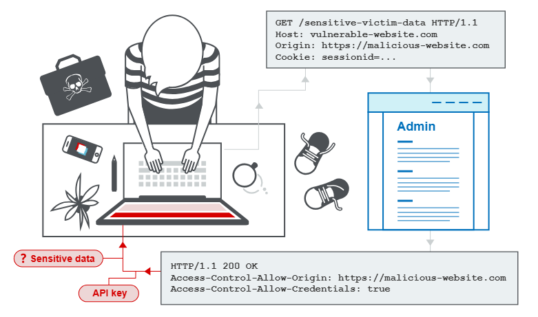
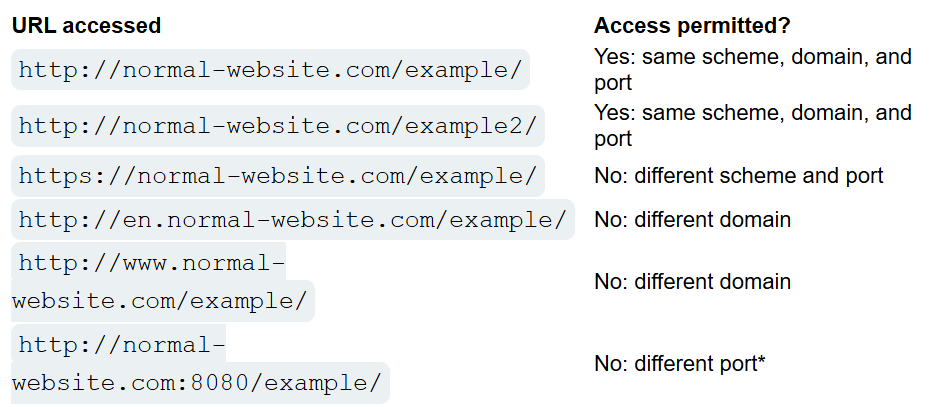

# Cross-origin resource sharing (CORS)

## Cross-origin resource sharing (CORS) là gì
CORS là 1 một cơ chế trình duyệt cho phép truy cập được vào các tài nguyên nằm ngoài một miền nhất định.

## Same-origin policy (Chính sách cùng nguồn)
Same-origin policy (SOP) là kỹ thuật hạn chế chéo nguồn gốc, giới hạn khả năng tương tác của một trang web với các tài nguyên bên ngoài miền nguồn. Cụ thể, chính sách này hạn chế tập lệnh truy cập dữ liệu từ nguồn khác của 1 nguồn. Nguồn (nguồn gốc) bao gồm URL, tên miền, số cổng.

## Access-Control-Allow-Origin header
Giả sử một trang web có nguồn gốc `normal-website.com` gây ra yêu cầu liên miền sau:
```
GET /data HTTP/1.1
Host: robust-website.com
Origin : https://normal-website.com
```
Máy chủ robust-website.com trả về phản hồi sau:

```
HTTP/1.1 200 OK
...
Access-Control-Allow-Origin: https://normal-website.com
```
Trình duyệt đang chạy `normal-website.com` so sánh `Access-Control-Allow-Origin` và `Origin` để quyết định xem response này có thành công hay không.
```
Tóm lại, `Access-Control-Allow-Origin` giúp xác định nguồn gốc response từ server và cho phép nhận response này hay không.
```
Một số kết quả lưu ý của Access-Control-Allow-Origin:  
- `*`: Cho phép tất cả dù là nguồn nào  
- `null`: không có nguồn nào


## Pre-flight check and request
Pre-flight check là phần 