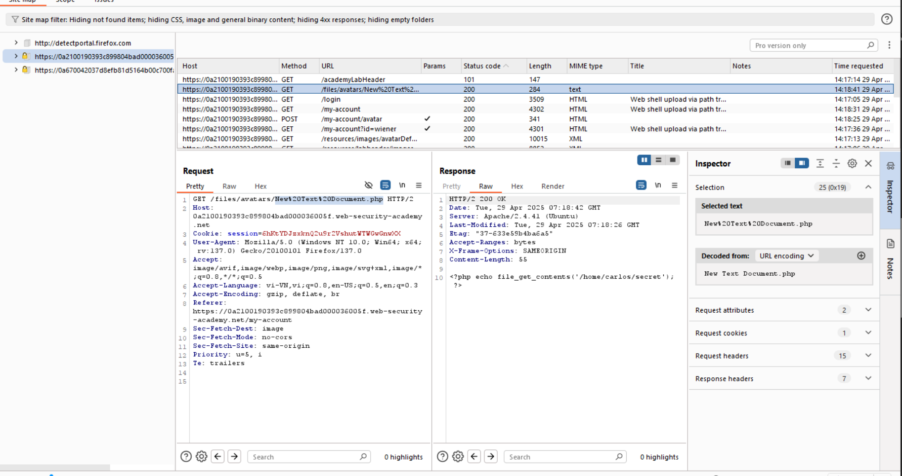

# Lỗ hổng File Uploads 

## Lỗ hổng File Uploads là gì?
Lỗ hổng này xảy ra khi cho phép người dùng tải tệp lên mà không có sự kiểm tra tương xứng ở các thuộc tính như tên, loại, kích thước... Việc kiểm tra lỏng lẻo có thể dẫn tới nguy hiểm cho hệ thống, thậm chí là RCE.  
Một số trường hợp có thể kể tới là kẻ tấn công gửi lên tệp cùng tên để ghi đè, gửi lên 1 tệp là 1 đoạn mã độc, tải lên 1 tệp quá lớn dẫn tới bị Dos.
## Khai thác việc file upload không kiểm tra để triển khai web shell
``` 
Web shell là một tập lệnh độc hại cho phép kẻ tấn công thực thi các lệnh tùy ý trên máy chủ web từ xa chỉ bằng cách gửi yêu cầu HTTP đến đúng endpoint.
```
### Bài lab: Remote code execution via web shell upload
Mục tiêu bài lab: Thực hiện khai thác lỗ hổng khi upload hình ảnh. Trong đó khi upload ảnh, server không thực hiện kiểm tra nào khi lưu trữ. Tải lên 1 webshell PHP để trích xuất nội dung tệp /home/carlos/secret.
Upload file PHP này ở phần thay đổi avatar

Chuyển tới phần My account, xem response của request tải lên phần avatar, khi đó sẽ thực thi file php đã tải lên, tìm được flag


Một số payload khác để lấy param:
`<?php echo system($_GET['command']); ?>`

## Khai thác việc kiểm tra content-type lỗi
content-type là phần đươck kiểm tra với file upload. Tuy nhiên, phần này cũng có thể được bypass.
### Bài lab: Web shell upload via Content-Type restriction bypass
Mục tiêu bài lab: Thực hiện khai thác lỗ hổng khi upload hình ảnh. Trong đó khi upload ảnh, server kiểm tra content-type. Tải lên 1 webshell PHP để trích xuất nội dung tệp /home/carlos/secret.
Sửa content-type trong request

Chuyển tới phần My account, xem response của request tải lên phần avatar, khi đó sẽ thực thi file php đã tải lên, tìm được flag

## Bypass việc ngăn chặn các tệp mà người dùng có thể truy cập
Trong trường hợp này, sẽ cấu hình để không thực thi các tệp mà người dùng cung cấp. 
### Bài lab: Web shell upload via path traversal
Nếu như bài lab trước, tới đây sẽ thực thi được tệp, tuy nhiên, trường hợp này lại không thực thi mà chỉ in ra nội dung tệp

Ý tưởng là lưu file ở 1 thư mục khác, ta sử dụng Path traversal. Thử thay tên file thành `../<tên file>`. Tuy nhiên kết quả trả về thấy không được

Mã hóa URL, lưu thành công

Chuyển tới phần My account, xem response của request tải lên phần avatar, sửa với thư mục ta đã traversal, khi đó sẽ thực thi file php đã tải lên, tìm được flag


## Bypass danh mục các loại tệp nguy hiểm
Nếu khi upload file có phần kiểm tra extension tệp như .php, ... thì vẫn có thể bypass bằng các dạng extension như sử dụng các phần mở rộng tệp thay thế ít được biết đến hơn nhưng vẫn có thể thực thi được, chẳng hạn như .php5, .shtml, v.v.  
Một trường hợp khác là ghi đè file cấu hình để chuyển phần extension về mình mong muốn.

### Bài lab: Web shell upload via extension blacklist bypass
Mục tiêu bài lab: Ghi đè file cấu hình .htaccess của apache để cấu hình các file .lmao thành .php và thực thi.  
Tải được file .php5 lên nhưng không thực thi được

Ghi đè .htaccess để .lmaothành .php

Upload file lmao.lmao

Chuyển tới phần My account, xem response của request tải lên phần avatar, sửa với thư mục ta đã traversal, khi đó sẽ thực thi file php đã tải lên, tìm được flag
 

Một trường hợp nữa là sử dụng các biện pháp khác như:
- Cung cấp nhiều phần mở rộng `lmao.php.jpg`
- Thêm ký tự sau `lmao.php.`
- Mã hóa   `lmao%2E.php`
- Thêm dấu chấm phẩy hoặc ký tự null byte:
 `exploit.asp;.jpg` hoặc `exploit.asp%00.jpg`

### Bài lab: Web shell upload via obfuscated file extension
Mục tiêu bài lab: Thực hiện khai thác lỗ hổng khi upload hình ảnh. Trong bài lab này có thể bypass bằng các kỹ thuật làm mờ extension. Tải lên 1 webshell PHP để trích xuất nội dung tệp /home/carlos/secret.
Đổi tên file thành `lmao.php%00.jpg`, khi đó thấy màn hình hiện thông báo upload lmao.php thành công.  
Gửi gói tin GET xem nội dung file và lấy flag


## Bypass kiểm tra nội dung tệp
Thay vì kiểm tra content-type như trước, giờ đây sẽ kiểm tra nội dung file, ví dụ như ảnh nội dung file mã hóa thường sẽ có các byte `FF D8 FF` ở đầu. Sử dụng các công cụ đặc biệt, chẳng hạn như ExifTool, có thể dễ dàng tạo tệp JPEG đa ngôn ngữ chứa mã độc hại trong siêu dữ liệu của tệp.

Viết nốt nha

