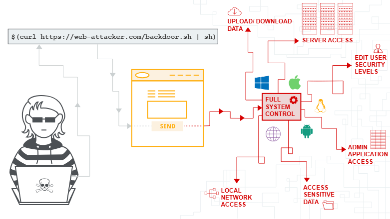
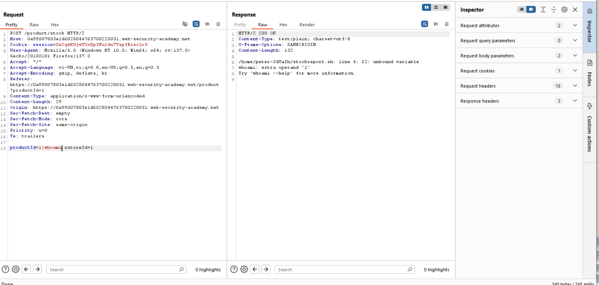
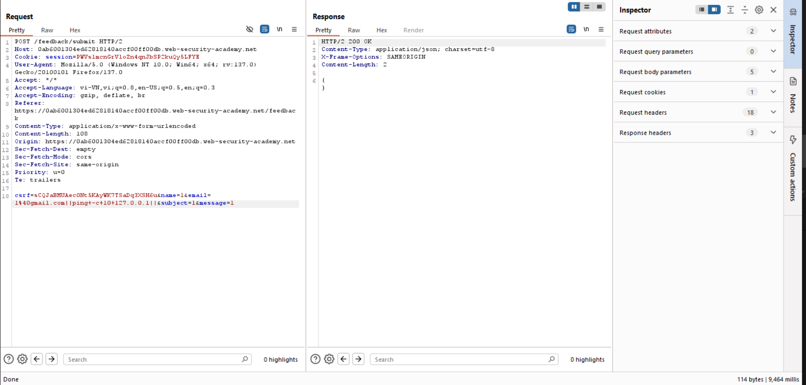
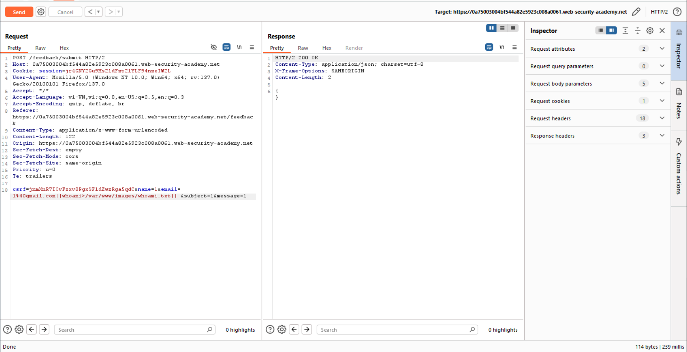
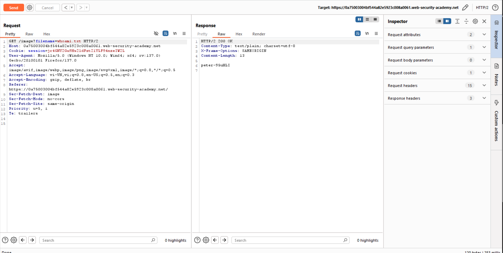

# OS command injection

## OS command injection là gì?
OS command injection (hay shell injection) là lỗ hổng khiến kẻ tấn công có thể thực thi OS command ở server, từ đó ảnh hưởng tới toàn ứng dụng/web và dữ liệu.
## Inject OS command 
Trong trường hợp này, khi gọi URL sau:
```
https://insecure-website.com/stockStatus?productID=381&storeID=29
```
Server sẽ thực hiện command tương ứng: 
```
stockreport.pl 381 29
```
Khi đó kẻ tấn công inject vào URL ở 29 và command trở thành
```
stockreport.pl & echo aiwefwlguh & 29
```
Câu command bị lỗi và thực hiện echo aiwefwlguh.
### Bài lab: OS command injection, simple case
Mục tiêu bài lab: Khai thác OS Command Injection. Trong bài này, phải làm sao để thực thi lệnh whoami à có phản hồi ở response

Tại sao không phải là payload & whoami &? Do payload này không hiện kết quả ra response mà chạy ngầm

### Một số OS Command cần cho việc khai thác
| Purpose of Command       | Linux        | Windows        |
|--------------------------|--------------|----------------|
| Name of current user     | `whoami`     | `whoami`       |
| Operating system         | `uname -a`   | `ver`          |
| Network configuration    | `ifconfig`   | `ipconfig /all`|
| Network connections      | `netstat -an`| `netstat -an`  |
| Running processes        | `ps -ef`     | `tasklist`     |

### Lỗ hổng OS Cammand Inject Blind
Trong phần nhiều các trường hợp, thường sẽ không có response trả về. 

### Bài lab: Blind OS command injection with time delays
Mục tiêu bài lab: Bài lab chứa lỗ hổng OS Command ở chức năng feedback. Cần khai thác lỗ hổng này để delay 10 giây. Điều này cũng có ý nghĩa trong việc check xem có inject được OS Command hay không.


### Bài lab: Blind OS command injection with output redirection
Mục tiêu bài lab: Bài lab chứa lỗ hổng OS Command ở chức năng feedback. Cần khai thác lỗ hổng này để chuyển hướng output khi thực thi lệnh whoami thay vì response (do response không hiện kết quả) vào 1 tệp mong muốn. Cụ thể là /var/www/images/.
Chuyển về /var/www/images/

Xem file


## Cách command có thể dùng để inject
Một số ký tự hoạt động như các dấu phân cách lệnh, cho phép các lệnh được nối lại với nhau. Các dấu phân cách lệnh sau đây hoạt động trên cả hệ thống Windows và Unix:
```
&
&&
|
||
```
Các lệnh phân cách sau đây chỉ hoạt động trên hệ thống chạy trên Unix:
```
;
Newline ( 0x0a hoặc \n)
```
Trên các hệ thống chạy trên Unix, cũng có thể sử dụng dấu ngoặc kép hoặc ký tự đô la để thực hiện lệnh được đưa vào trong lệnh gốc:
```
`
lệnh `
$(
lệnh)
```