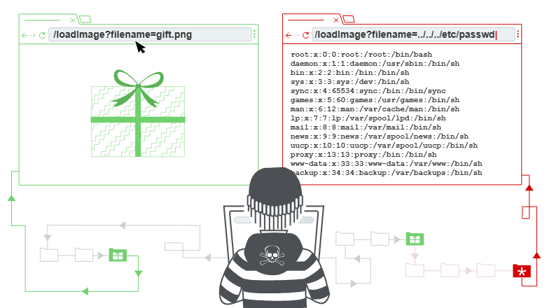
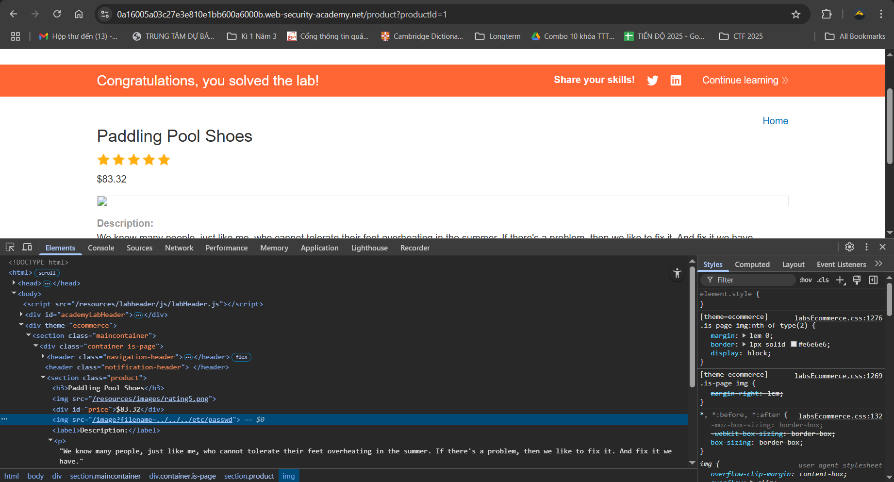
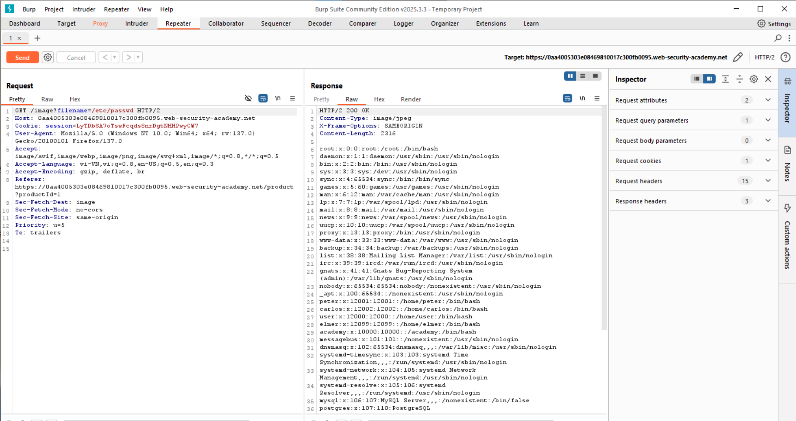
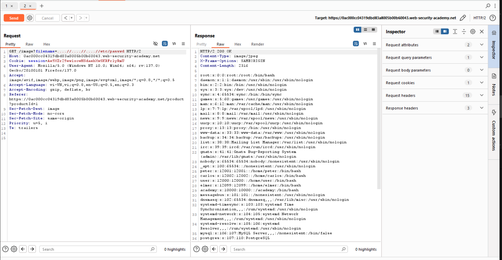
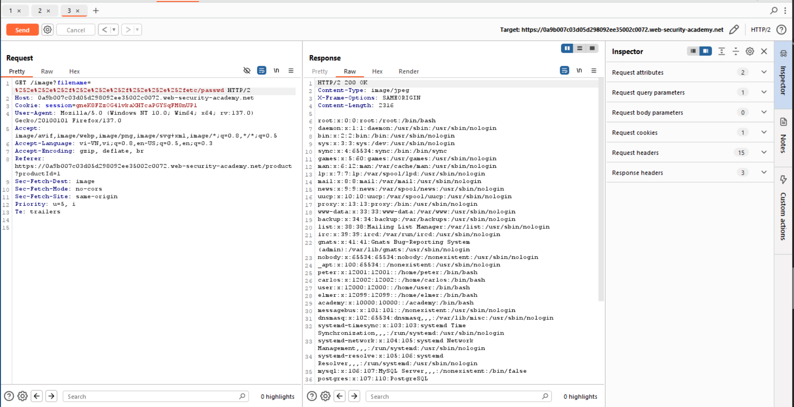
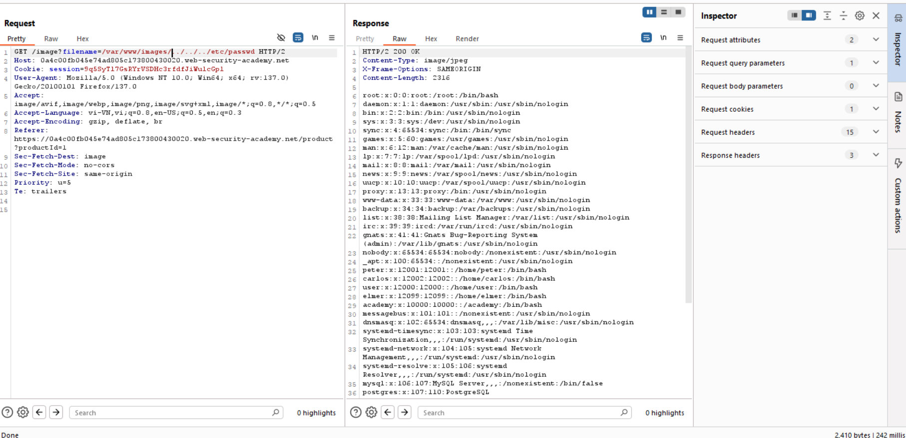
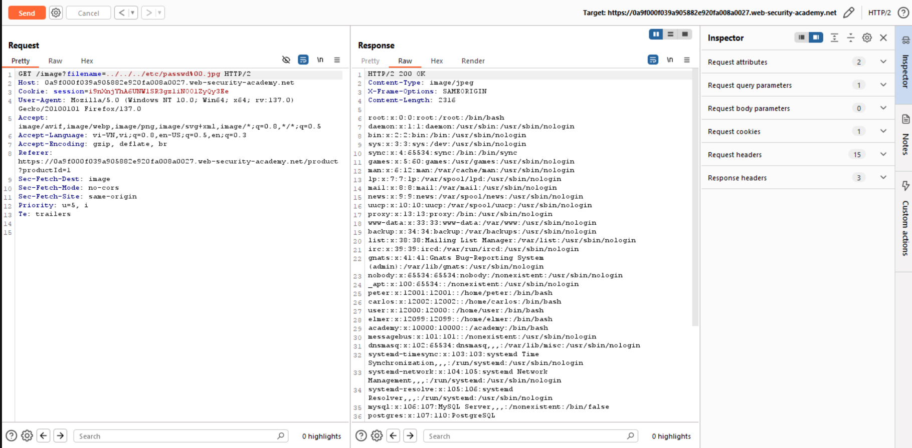

# Path traversal

## Path traversal là gì
Path traversal là lỗ hổng cho phép kẻ tấn công có thể đọc các file hoặc tệp trong server mà web/ứng dụng đang chạy. Trong 1 số trường hợp xấu, kẻ tấn công có thể ghi đè, chiếm quyền kiểm soát server.
## Đọc file với path traversal (via traversal)
Ví dụ khi tải 1 bài viết có ảnh: 
``` 
 
```
Lúc này đường dẫn của file ảnh là ```/var/www/images/218.png```. Kẻ tấn công sửa thành ```../../../etc/passwd```. Hoặc ở windows, là ```..\..\..\windows\win.ini```. 
### Bài lab: File path traversal, simple case
Mục tiêu bài lab: Khai thác path traversal ở phần hiện ảnh sản phẩm lấy lấy nội dung file /etc/passwd.

Sửa đường dẫn của ảnh là hoàn thành bài lab. Hoặc có thể bắt gói tin HTTP GET bằng burp suite và sửa request.

### Bài lab: File path traversal, traversal sequences blocked with absolute path bypass
Mục tiêu bài lab: Khai thác path traversal ở phần hiện ảnh sản phẩm lấy lấy nội dung file /etc/passwd. Trong bài lab này cần sử dụng đường dẫn tuyệt đối.

Chỉnh sửa đường dẫn của file thành đường dẫn tuyệt đối để chỉ đến /etc/passwd bài lab được hoàn thành
### Bài lab: File path traversal, traversal sequences stripped non-recursively
Mục tiêu bài lab: Khai thác path traversal ở phần hiện ảnh sản phẩm lấy lấy nội dung file /etc/passwd. Trong bài lab này các đường dẫn dạng `../` bị xóa 

Do `../` bị xóa nên ta thay bằng `....//`, khi bị xóa sẽ trở lại thành `../`

### Bài lab: File path traversal, traversal sequences stripped with superfluous URL-decode
Với các trường hợp xóa tận cùng `../`, ta có thể thử với một số cách mã hóa vẫn ra `../` trong URL, ví dụ như `%2e%2e%2f`, `%252e%252e%252f`...
Mục tiêu bài lab: Khai thác path traversal ở phần hiện ảnh sản phẩm lấy lấy nội dung file /etc/passwd. Trong bài lab này các đường dẫn dạng `../` bị xóa tận cùng

Trong trường hợp này, phải mã hóa 2 lần URL thì mới có thể thực hiện được.
```
Mã hóa URL (hay còn gọi là percent-encoding) là cách thay thế các ký tự đặc biệt trong URL bằng % + mã hex của ký tự đó.
Ví dụ:
Ký tự   | Mã hóa URL
---------------------
.       | %2e
/       | %2f
%       | %25
(space) | %20
```
### Bài lab: File path traversal, validation of start of path
Mục tiêu bài lab: Khai thác path traversal ở phần hiện ảnh sản phẩm lấy lấy nội dung file /etc/passwd. Trong bài lab này các đường dẫn được check phải bắt đầu bằng đường dẫn cũ, tránh bị sửa đổi.  
Sửa đường dẫn thành `/var/www/images/8.jpg` thành `/var/www/images/../../../etc/passwd`


### Bài lab: File path traversal, validation of file extension with null byte bypass
Mục tiêu bài lab: Khai thác path traversal ở phần hiện ảnh sản phẩm lấy lấy nội dung file /etc/passwd. Trong bài lab này các đường dẫn được check phải có phần extension đúng, ví dụ `.png `. 

Thay đổi thêm %00 để thành null byte, khi đó sẽ hiểu là phần này là kết thúc chuỗi, do đó bypass được