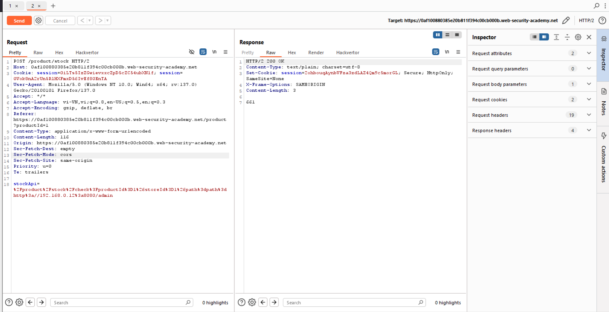

# Server-side request forgery (SSRF)

## SSRF là gì?
Server-side request forgery (giả mạo yêu cầu phía máy chủ) là lỗ hổng bảo mật web cho phép kẻ tấn công khiến ứng dụng phía máy chủ thực hiện yêu cầu đến một vị trí không mong muốn.  
Trong một cuộc tấn công SSRF thông thường, kẻ tấn công có thể khiến máy chủ kết nối với các dịch vụ chỉ dành cho nội bộ trong cơ sở hạ tầng của tổ chức. Trong các trường hợp khác, chúng có thể buộc máy chủ kết nối với các hệ thống bên ngoài tùy ý. 
## Tấn công SSRF vào máy chủ
Trong một cuộc tấn công SSRF vào máy chủ, kẻ tấn công khiến ứng dụng thực hiện một yêu cầu HTTP trở lại máy chủ đang lưu trữ ứng dụng, thông qua giao diện mạng loopback, localhost của chính máy chủ.  
Ví dụ với 1 gói tin HTTP, phần stock được lấy từ API ở chính máy chủ:
```
POST /product/stock HTTP/1.0
Content-Type: application/x-www-form-urlencoded
Content-Length: 118

stockApi=http://stock.weliketoshop.net:8080/product/stock/check%3FproductId%3D6%26storeId%3D1
```
Kẻ tấn công chỉ cần sửa API thành `stockApi=http://localhost/admin` để truy cập quản trị nếu có
### Bài lab: Basic SSRF against the local server
Mục tiêu bài lab: Trong bài lab có lỗ hổng SSRF ở chức năng check stock. Hoàn thành bài lab bằng cách sửa stock check URL thành http://localhost/admin và xóa user Carlos
Sửa request

Giao diện admin hiện ra

Bắt được API để xóa carlos

Nhập API này vào stock API như cũ là hoàn thành

Lý do tại sao sử dụng API như vậy:
- Có gói tin khác để kiểm tra admin
- Sử dụng khi trường hợp khẩn cấp, quản trị không cần đăng nhập
- Dù sao thì hoạt động trên cổng khác, người dùng bình thường không biết sự tồn tại cổng này
## Tấn công SSRF vào các hệ thống phụ trợ khác
Tương tự trường hợp tấn công vào máy chủ, lỗ hổng chỉ đơn giản chuyển từ máy chủ sang 1 hệ thống phụ trợ mà người dùng không biết sự tồn tại của nó. Các hệ thống này có IP riêng và không thể định tuyến tới. 

### Bài lab: Basic SSRF against another back-end system
Thử scan với các IP


Xóa Carlos


## Bypass phòng thủ SSRF với blacklist
Một số ứng dụng chặn đầu vào chứa tên máy chủ như 127.0.0.1và localhost, hoặc URL nhạy cảm như /admin. Trong trường hợp này, bạn thường có thể bỏ qua bộ lọc bằng các kỹ thuật sau:

- Sử dụng biểu diễn IP thay thế của 127.0.0.1, chẳng hạn như 2130706433, 017700000001, hoặc 127.1.
- Đăng ký tên miền của riêng bạn có độ phân giải là 127.0.0.1. Bạn có thể sử dụng spoofed.burpcollaborator.netcho mục đích này.
- Làm tối nghĩa các chuỗi bị chặn bằng cách sử dụng mã hóa URL hoặc thay đổi chữ hoa chữ thường.
- Cung cấp một URL mà bạn kiểm soát, chuyển hướng đến URL mục tiêu. Hãy thử sử dụng các mã chuyển hướng khác nhau, cũng như các giao thức khác nhau cho URL mục tiêu. Ví dụ, việc chuyển đổi từ URL http:sang https:URL trong quá trình chuyển hướng đã được chứng minh là có thể bỏ qua một số bộ lọc chống SSRF.
### Bài lab: SSRF with blacklist-based input filter
Mục tiêu bài lab: Khai thác lỗ hổng SSRF với chức năng stock check. Đổi URL http://localhost/admin và xóa user Carlos. Trong bài lab này có 2 lớp chống SSRF yếu có thể bypass.

Thử với các từ khóa localhost, 127.0.0.1,... đều không được.
`127.1` bypass được

Tuy nhiên `/admin` bị chặn

Convert encode URL 2 lần thì bypass được

Xóa user carlos


## Bypass SSRF filter via open direction (với chuyển hướng mở)
Kẻ tấn công thêm 1 đoạn url `&path=http://evil-user.net` để thực hiện trên url mà kẻ tấn công mong muốn. Phương pháp này bypass được cả blacklist, cả whitelist. Tuy nhiên, API được thêm vào phải có đáp ứng được filter để chuyển hướng. Trong trường hợp đơn giản nhất, filter chỉ check đoạn đầu của API.
### Bài lab: SSRF with filter bypass via open redirection vulnerability
Mục tiêu bài lab: Khai thác lỗ hổng SSRF via open redirection với chức năng stock check. Đổi URL http://192.168.0.12:8080/admin và xóa user Carlos. 

Với chức năng xem số lượng stock, không thể bypass

Chức năng next stock có sẵn via open redirection ta cần sử dụng 

Bypass


