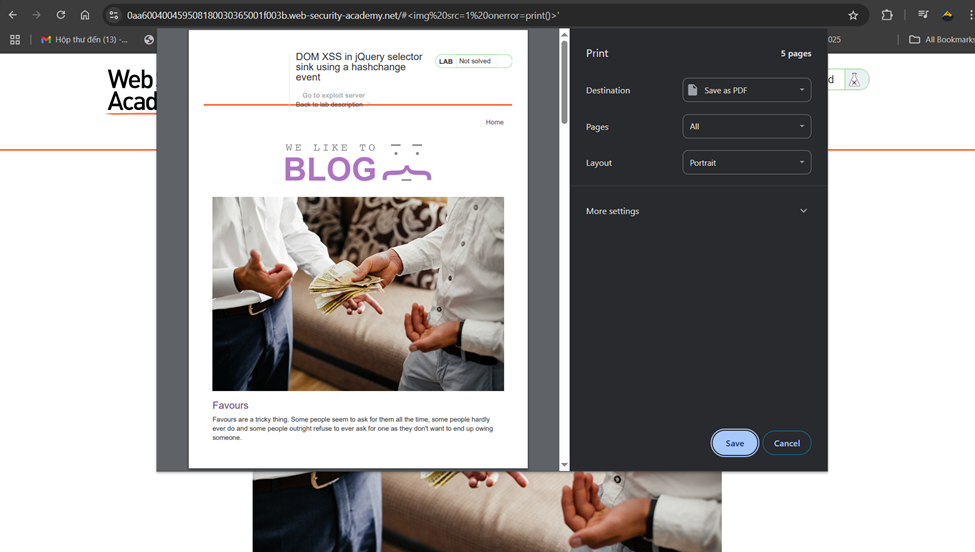
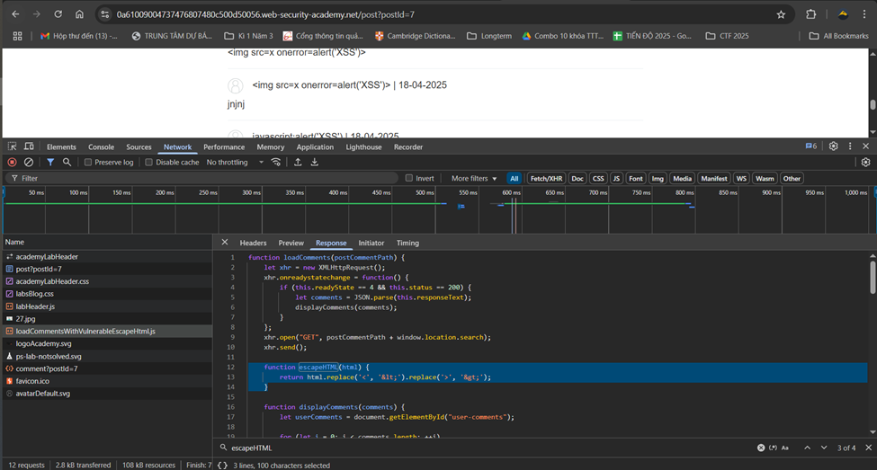
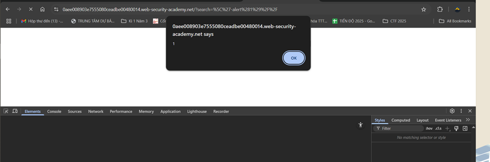

# Cross-site scripting (XSS)
## XSS là gì 
XSS là lỗ hổng bảo mật cho phép kẻ tấn công xâm phạm tương tác người dùng dưới danh nghĩa của người dùng bằng việc chèn 1 đoạn mã độc.

XSS hoạt động bằng cách thao túng 1 web để trả về JavaScrypt độc hại cho người dùng. Khi mã độc được thực thi thì kẻ tấn công xâm phạm hoàn toàn tương tác của người dùng.
``` 
3 dạng tấn công chính:
- Reflected XSS: mã độc tới từ HTTP Request
- Stored XSS: mã độc từ database website
- DOM-based XSS: lỗ hổng từ phía code client
```
## Reflected XSS
Lỗ hổng diễn ra khi web app nhận được data từ HTTP request và trả về response data đó. Trong trường hợp này, data được gán 1 cách không an toàn khiến dễ bị sửa đổi
Ví dụ trong trường hợp này với 1 URL của server: 

Với url được server trả về khi thông báo về trạng thái:
```
https://insecure-website.com/status?message=All+is+well.
```
HTML hiển thị tương ứng:
```
<p>Status: All is well.</p>
```
Nếu không có 1 bước nào được thêm, kẻ tấn công dễ dàng chèn trong đoạn thông báo này thành 1 mã độc
URL trở thành: 
```
https://insecure-website.com/status?message=<script>/*+Bad+stuff+here...+*/</script>
```
Lúc đó HTML hiển thị: 
```
<p>Status: <script>/* Bad stuff here... */</script></p>
```
Khi người dùng mở tải web, đồng nghĩa với tải đoạn mã này và kẻ tấn công dễ dàng thực thi tập lệnh với hành động mà kẻ tấn công mong muốn.  
Ngoài ra, kẻ tấn công cũng có thể sửa cả request tương tự. Suy cho cùng lỗi này từ việc gán dữ liệu không an toàn.


### Bài lab: Reflected XSS trong ngữ cảnh HTML với không mã hóa
Nhiệm vụ bài lab: Thực hiện tấn công XSS để gọi hàm alert 
Khi tôi tra lmao, web sẽ hiện cả keyword mình tra 

HTML tương ứng:

Vậy để gọi được hàm alert, tôi sẽ thay thế lmao bằng 1 đoạn mã: `<script>alert("lmao")</script>`

Hàm alert được gọi thành công

## Stored XSS
Lỗ hổng này diễn ra khi web nhận 1 dữ liệu từ 1 nguồn không đáng tin cậy và đưa dữ liệu đó vào HTTP response 1 cách không an toàn.  
Giả sử 1 web cho phép người dùng đăng comment của mình. Người dùng sử dụng HTTP Request sau để đăng comment:

```
POST /post/comment HTTP/1.1
Host: vulnerable-website.com
Content-Length: 100

postId=3&comment=This+post+was+extremely+helpful.&name=Carlos+Montoya&email=carlos%40normal-user.net
```
Khi đó HTML hiện là: 
```
<p>This post was extremely helpful.</p>
```
Kẻ tấn công giờ với vai trò là người dùng bình thường gửi 1 comment với nội dung:
```
<script>/* Bad stuff here... */</script>
```
Khi ai đó vào xem comment này, sẽ nhận được response trả về: 
```
<p><script>/* Bad stuff here... */</script></p>
```
Dòng lệnh mã độc được chạy. Ở đây, dòng lệnh này được lưu trữ lại và khi được sử dụng trong cơ sở dữ liệu thì nó hoạt động. Đây là điểm khác biệt với Reflected XSS là sự có mặt của lưu trữ.

### Bài lab: Reflected XSS trong ngữ cảnh HTML với không mã hóa
Nhiệm vụ bài lab: Thực hiện tấn công XSS bằng cách đăng 1 comment gọi hàm alert khi có ai xem comment  
Nội dung đăng comment:

Kết quả khi xem post có comment đó:


## DOM-based XSS
Lỗ hổng này diễn ra khi JavaScript lấy data từ nguồn mà kẻ tấn công có thể kiểm soát, như URL và chuyển đến bộ đệm (sink) hỗ trợ thực thi mã động như eval(), innerHTML...  
### Một vài bộ đệm dễ xảy Ra XSS:  
[DANH SÁCH BỘ ĐỆM NGUY HIỂM](https://portswigger.net/web-security/cross-site-scripting/dom-based#which-sinks-can-lead-to-dom-xss-vulnerabilities)
- `eval()`: một hàm trong JavaScript cho phép thực thi một đoạn mã JavaScript được truyền vào dưới dạng chuỗi. Ví dụ `eval(console.log("You're hacked);)` sẽ thực thi câu lệnh `console.log("You're hacked);`  

- `innerHTML`:là một thuộc tính trong JavaScript cho phép đọc hoặc ghi nội dung HTML của một phần tử.  
Ví dụ: Đọc nội dung HTML từ 1 phần tử: 
 
Thay đổi nội dung HTML 1 phần tử:   
  

Kịch bản dễ thấy của cuộc tấn công là kẻ tấn công truyền dữ liệu vào nguồn thường thấy là URL, và khi truy cập URL này thì cuộc tấn công diễn ra. Nguồn URL thường được truy cập bằng `window.location`
### Bài lab: DOM XSS in document.write sink using source location.search
Nhiệm vụ bài lab: Thực hiện cuộc tấn công DOM XSS để gọi hàm alert sử dụng document.write sink và nguồn là location.search  
Ta thấy đoạn script trong html:

Ở đây nguồn nguy hiểm là location.search để lấy thông tin từ URL và sau đó ghép để hiện hình ảnh:
`` Kẻ tấn công thực hiện 1 kiểu inject để đoạn script nguy hiểm sẽ có ở thẻ img này bằng cách nhập query: `"><svg onload=alert("lmao")>`. Khi đó sẽ được tách thành 2 thẻ đó là thẻ img và svg. Thẻ svg phát sinh để gọi alert 

Kết quả bài lab.


### Bài lab: DOM XSS in document.write sink using source location.search trong 1 thẻ \<select>


### Bài lab: DOM XSS in jQuery anchor href attribute sink using location.search source
Mục tiêu bài lab: Khai thác XSS DOM-based để alert ra document.cookie
 Đoạn script ở trang feedback cho thấy khi ấn Back, đoạn mã sẽ lấy param returnPath ở URL làm đầu vào rồi chạy ở trang tương ứng 
 
Như ở đây, là vào trang /post
 
Sửa returnPath thành 
 
### Bài lab: DOM XSS in jQuery selector sink using a hashchange event
Mục tiêu bài lab: Khai thác lỗ hổng XSS DOM-based cross-site scripting với hàm lấy $() của jQuery để auto-scroll tới post cho trước, title của post ở trong location.hash.
Phần script này lấy hashchange và auto-scroll tới title post
 
Gọi tới title bài post để auto-scroll bằng cách thêm `#<tên bài post>`
 
Thử thay đổi hashchange để thực hiện in
 
Trong server exploit thêm đoạn này:
```
<iframe src="https:// 0aa600400459508180030365001f003b.web-security-academy.net/#" onload="this.src+=''"></iframe>
```

Khi khai thác, đoạn này được chèn thêm và lệnh print() để in cả trang được tạo ra như ở trên, XSS thành công.
### Bài lab: DOM XSS in AngularJS expression with angle brackets and double quotes HTML-encoded
Mục tiêu bài lab: Thực hiện XSS DOM-based cross-site scripting ở framework AngularJS với chức năng search để gọi hàm alert().
Mấu chốt bài lab: AngularJS là một thư viện JavaScript phổ biến, quét nội dung của các nút HTML có chứa thuộc tính ng-app (còn được gọi là chỉ thị AngularJS). Khi một trang web sử dụng thuộc tính ng-app trên một phần tử HTML, nó sẽ được AngularJS xử lý. Trong trường hợp này, AngularJS có syntax thực thi JavaScript bên trong dấu ngoặc nhọn kép (dấu `{` ) với điều kiện phải bật ng-app để chạy AngularJS ở nút đó. Ví dụ: `<p>{{1+1}}</p>` nếu trong nút cha có chứa ng-app thì sẽ hiện thành `<p>2</p>`
Phần có thuộc tính ng-app trong web:
 
Khi search với từ lmao, từ lmao được in ra
 
Ý tưởng là tạo 1 câu lệnh để Angular có thể thực thi, câu lệnh này được nằm trong dấu {}, ta thử với 1+1. Từ khóa tìm kiếm là {{1+1}}, kết quả ra 2, nghĩa là Angular có thực thi
 
Vậy payload là: {{$on.constructor('alert("lmao")')()}} để in alert
 
### Bài lab: Reflected DOM XSS
Mục tiêu bài lab: Thực hiện Reflected DOM XSS với script có sẵn, reflect data trong request ở response, khi gọi data thì thực hiện được XSS
Khi thực hiện chức năng search, ta thấy file searchResults.js có dòng có chứa eval(), hàm eval này thực hiện khai báo 1 biến mới tên searchResultsObject và biến này được show lên màn hình kết quả ở hàm dưới
 
TÌm responsetext thì là file sau: 
 
Dựa vào code trên và responsetext, thấy rằng searchTerm là phần được ren ra màn hình. Ta sẽ lợi dụng dòng này để XSS: 
```
eval('var searchResultsObj = ' + this.responseText);
Payload là \"-alert(1)}//
```
, lúc đó dòng này sẽ trở thành: 
```
eval('var searchResultsObj = \"-alert(1)}//'); 
```
Phần \"- để  tạo một biểu thức không nhận dạng được, do đó alert chạy 
 
### Bài lab: Stored DOM XSS
Mục tiêu bài lab: Thực hiện XSS trên chức năng comment để thực hiện hàm alert
Ở bài lab này, ta không thể khai thác Stored XSS thông thường, bởi có escape như sau:
 
Tuy nhiên do hàm replace chỉ thực hiện 1 lần nên phần chống XSS này dễ bị vượt qua với payload sau: <>
 
### Bài lab: Reflected XSS into HTML context with most tags and attributes blocked
Nhiệm vụ bài lab: Thực hiện cuộc tấn công reflected XSS, bypass WAF và gọi hàm print()
Thử với payload 
 
Ta sẽ thử với các payload trong CHEAT SHEET của port swiger , trước tiên thử với các payload là tags trước, khi các response status trả về 200 là thành công
 
Thu được kết quả tags body ổn. Tiếp tục thử với tags là body và thay đổi các events và tương tự. Thấy event là onresize ổn. Ta cần chèn đoạn sau để thực hiện khai thác thành công:
```
<iframe src="https:// 0a7100520321d37981f489a000ca000d.web-security-academy.net/?search=%22%3E%3Cbody%20onresize=print()%3E" onload=this.style.width='100px'>
```
### Bài lab: Reflected XSS into HTML context with all tags blocked except custom ones
Mục tiêu bài lab:
Do bị block hết các tag HTML tiêu chuẩn đầu vào nên mình dùng dạng không tiêu chuẩn (customes): <lmao>

### Bài lab: Reflected XSS into attribute with angle brackets HTML-encoded
Mục tiêu bài lab: Thực hiện reflected cross-site scripting trong chức năng search blog. Dấu ngoặc nhọn (dấu ><) trong bài này đã bị mã hóa.
Trong bài lab này, do các dấu trên đã bị mã hóa, ta cần inject vào 1 event chứ không phải 1 tag như thông thường, payload sẽ là: "onmouseover="alert(1) (khi di chuột vào input thì sẽ có alert)
 
### Bài lab: Stored XSS into anchor href attribute with double quotes HTML-encoded
Mục tiêu bài lab: Thực hiện Stored XSS ở chức năng comment. Để hoàn thành, phải gọi alert khi click vào author name.
Thực hiện:
 
### Bài lab: Reflected XSS in canonical link tag
Mục tiêu bài lab: Thực hiện XSS ở homepage để gọi hàm alert bằng cách inject atribute trong thẻ link
Trong bài lab này, cần chú ý tới url và phần link, khi thay đổi URL phần canonical link cũng thay đổi
 
Thay đổi bằng /?lmao
 
Nhờ sự thay đổi này, ta có thể thực hiện XSS. Ta inject thêm vào URL:
/?'accesskey='x'onclick=' alert(1), Lúc đó thẻ link trở thành
 
### Bài lab: Reflected XSS into a JavaScript string with single quote and backslash escaped
Mục tiêu bài lab: Thực hiện tấn công reflected XSS trong chức năng search tracking. Phần reflection xảy ra trong đoạn mã JS .
Đoạn JS có chứa lỗ hổng khi reflect lại nội dung tìm kiếm ở searchTerms
 
Payload là `</script><script>alert(1)</script>`
 
### Bài lab: Reflected XSS into a JavaScript string with angle brackets HTML encoded
Mục tiêu bài lab: Thực hiện tấn công reflected XSS trong chức năng search tracking. Phần reflection xảy ra trong đoạn mã JS đã bị encode.
Ở bài này, nếu làm như trước sẽ bị mã hóa:
 
Tuy nhiên 1 số ký tự như -,? Vẫn không sao
 
Thực hiện inject để biến thành một biến thức gây lỗi buộc phải thực hiện alert. Payload là '/alert(1)/'. Câu lệnh trở thành var searchTerm = ‘’ / alert(1) / ‘’
 


### Bài lab: Reflected XSS into a JavaScript string with angle brackets and double quotes HTML-encoded and single quotes escaped
Khác với bài lab trước, dấu ‘ được xử lý hợp lý hơn tránh trường hợp inject dấu này 
 
Nhưng phần xử lý dấu ‘ này có thể bypass bằng cách sử dụng \’
 
\’ sẽ tạo với ‘ thành chuỗi ‘//’ giờ chỉ cần làm với kỹ thuật giống với lab trên, 
payload là \'-alert(1)//
 
